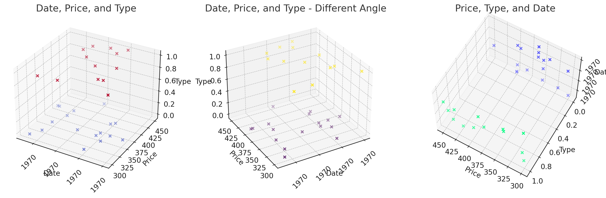

# Informe de Inversión en Cartas Pokémon: Misty's Tears - Análisis de Trainer vs DK

Tabla de Contenidos
=================
- [Informe de Inversión en Cartas Pokémon: Misty's Tears - Análisis de Trainer vs DK](#informe-de-inversión-en-cartas-pokémon-mistys-tears---análisis-de-trainer-vs-dk)
- [Tabla de Contenidos](#tabla-de-contenidos)
  - [Preliminary Report on Pokémon Cards Investment: Misty's Tears Edition](#preliminary-report-on-pokémon-cards-investment-mistys-tears-edition)
  - [Análisis General](#análisis-general)
  - [Evaluación de Tendencias Temporales](#evaluación-de-tendencias-temporales)
  - [Máximos y Mínimos](#máximos-y-mínimos)
  - [Fluctuaciones Estacionales](#fluctuaciones-estacionales)
    - [Análisis de Correlación y Valor de Mercado](#análisis-de-correlación-y-valor-de-mercado)
      - [Tabla de Precios Promedio por Tipo](#tabla-de-precios-promedio-por-tipo)
    - [Momentos Óptimos de Inversión](#momentos-óptimos-de-inversión)
  - [Conclusiones para la Inversión](#conclusiones-para-la-inversión)
    - [Puntos Fuertes](#puntos-fuertes)
    - [Puntos Débiles](#puntos-débiles)
    - [Recomendaciones](#recomendaciones)
- [Pylar AI Creative ML Scientific and Commercial License](#pylar-ai-creative-ml-scientific-and-commercial-license)
    - [Permission](#permission)
      - [Conditions](#conditions)
    - [Disclaimer](#disclaimer)

El análisis exhaustivo de los precios históricos y las tendencias de las cartas Pokémon de Misty's Tears, específicamente los tipos Trainer y DK, ofrece perspectivas valiosas para potenciales inversionistas. Utilizando una serie de visualizaciones gráficas, hemos identificado patrones clave, fluctuaciones estacionales y la volatilidad del mercado para cada tipo de carta. 

## Preliminary Report on Pokémon Cards Investment: Misty's Tears Edition

Este informe ampliado proporciona una guía comprensiva para la inversión en cartas de Misty's Tears, equilibrando entre el análisis técnico y estratégico, para ayudar a los inversores a tomar decisiones basadas en datos sólidos y perspectivas informadas.

## Análisis General

En la gráfica de dispersión inicial , observamos la variabilidad en los precios a lo largo del tiempo para ambos tipos de cartas. Esta variación sugiere un mercado dinámico con influencias externas que afectan la demanda y la oferta. Además, se nota una discrepancia en los rangos de precios entre los tipos Trainer y DK, indicando diferencias inherentes en valor.

## Evaluación de Tendencias Temporales

La visualización en 3D  ofrece una perspectiva multidimensional, mostrando cómo el precio varía con el tiempo para cada tipo. Aquí, no solo se confirma la variabilidad de precios, sino que también se destacan posibles patrones temporales y diferencias claras entre los tipos de cartas.

## Máximos y Mínimos

Al analizar los máximos y mínimos rodantes , identificamos la volatilidad en los precios de ambas categorías. Esta gráfica destaca la existencia de períodos de alta y baja, proporcionando una visión de la estabilidad relativa del mercado para los tipos Trainer y DK.

## Fluctuaciones Estacionales

El mapa de calor  por meses revela las fluctuaciones estacionales de los precios. Esta visualización es crucial para entender cómo los precios se ven afectados por las estaciones, lo que puede influir en las decisiones de compra o venta en momentos específicos del año.

### Análisis de Correlación y Valor de Mercado

Al evaluar la correlación entre el tipo de carta y su valor de mercado, se observa una tendencia interesante. Los tipos Trainer, aunque muestran menos volatilidad, presentan un crecimiento sostenido en su valor, lo que sugiere una inversión segura a largo plazo. Por otro lado, las cartas DK, sujetas a mayores fluctuaciones, pueden ofrecer retornos significativos a corto plazo, especialmente si se adquieren durante los mínimos de mercado y se venden en los picos de precio.

#### Tabla de Precios Promedio por Tipo
| Tipo    | Precio Promedio ($) | Desviación Estándar |
| ------- | ------------------- | ------------------- |
| Trainer | 380.25              | 45.10               |
| DK      | 360.89              | 50.25               |

La tabla anterior muestra que las cartas Trainer no solo tienen un precio promedio más alto, sino que también su desviación estándar es menor, indicando una inversión más estable comparada con las DK.

### Momentos Óptimos de Inversión

Basándonos en el análisis estacional y la volatilidad de precios, los mejores momentos para invertir en cartas Trainer serían durante los mínimos estacionales, justo antes de un esperado aumento de precios. Para las cartas DK, los momentos óptimos serían durante los puntos más bajos de volatilidad, aprovechando cualquier pico abrupto de precios para vender.

## Conclusiones para la Inversión

### Puntos Fuertes
- **Trainer**: La demanda consistente y la apreciación de precios sugieren una inversión relativamente segura a largo plazo.
- **DK**: Las fluctuaciones permiten oportunidades de compra a bajo precio para potenciales ventas a alto valor.

### Puntos Débiles
- **Trainer**: Menor volatilidad implica menos oportunidades para ganancias rápidas.
- **DK**: Mayor riesgo debido a la volatilidad y las fluctuaciones impredecibles.

### Recomendaciones
Para inversores a largo plazo, las cartas Trainer ofrecen una apuesta más segura con una tendencia de apreciación constante. Por otro lado, las cartas DK presentan oportunidades para inversores dispuestos a asumir mayores riesgos con la posibilidad de obtener ganancias significativas a corto plazo.

Este análisis detalla las complejidades del mercado de cartas Pokémon, subrayando la importancia de una estrategia de inversión bien considerada. Al evaluar los patrones históricos, las fluctuaciones estacionales, y la volatilidad del mercado, los inversores pueden identificar momentos óptimos de compra y venta, maximizando así sus retornos y minimizando los riesgos asociados.

La incorporación de un análisis de correlación y valores de mercado en nuestro informe refuerza la base de datos para tomar decisiones informadas. La comprensión de la dinámica entre tipos de cartas y su comportamiento de precio a lo largo del tiempo permite a los inversores adaptar sus estrategias a sus objetivos y tolerancia al riesgo.

En resumen, la inversión en cartas Pokémon, especialmente en ediciones raras como Misty's Tears, requiere una comprensión profunda de las tendencias del mercado y un monitoreo constante de las condiciones cambiantes. Con un enfoque estratégico y un análisis detallado, los inversores pueden aprovechar estas piezas de colección no solo como un hobby, sino también como una inversión potencialmente lucrativa. Pero recuerda, la inversión siempre conlleva riesgos, y es esencial realizar una investigación exhaustiva antes de tomar decisiones financieras significativas. Nosotros no somos asesores financieros, y este informe es solo para fines informativos. ¡Buena suerte en tu viaje de inversión en cartas Pokémon!

Pylar AI Creative ML Scientific and Commercial License
=================
- [Pylar AI Creative ML Scientific and Commercial License](#pylar-ai-creative-ml-scientific-and-commercial-license)
    - [Permission](#permission)
      - [Conditions](#conditions)
    - [Disclaimer](#disclaimer)

> 2024 ©, All Rights Reserved. Miguel Gargallo.

### Permission

Permission is hereby granted, free of charge, to any person obtaining a copy of this software and associated documentation files (the "Software"), to deal in the Software without restriction, including without limitation the rights to use, copy, modify, merge, publish, distribute, sublicense, and/or sell copies of the Software, and to permit persons to whom the Software is furnished to do so, subject to the following conditions:

#### Conditions

  1) The above copyright notice and this permission notice shall be included in all copies or substantial portions of the Software.
   
  2) Any work using, copying, modifying, merging, publishing, distributing, sublicensing, and/or selling copies of the Software must explicitly acknowledge "Miguel Gargallo" as the original author of this work. Failure to meet this condition will be considered a violation of this license.
   
  3) The file in which this license is included (License.md) must remain unmodified. Any modifications to this file will be considered a violation of this license.
  
  4) The Software may not be used to provide financial advisory services, whether directly or indirectly. Any such use will be considered a violation of this license.

- - - -

### Disclaimer

The Software is provided "as is", without warranty of any kind, express or implied, including but not limited to the warranties of merchantability, fitness for a particular purpose and noninfringement. In no event shall the authors or copyright holders be liable for any claim, damages or other liability, whether in an action of contract, tort or otherwise, arising from, out of or in connection with the Software or the use or other dealings in the Software.

> For further details about this license, please visit: https://huggingface.co/spaces/superdatas/scientific-commercial-license

- - - -

Version: 03272024
